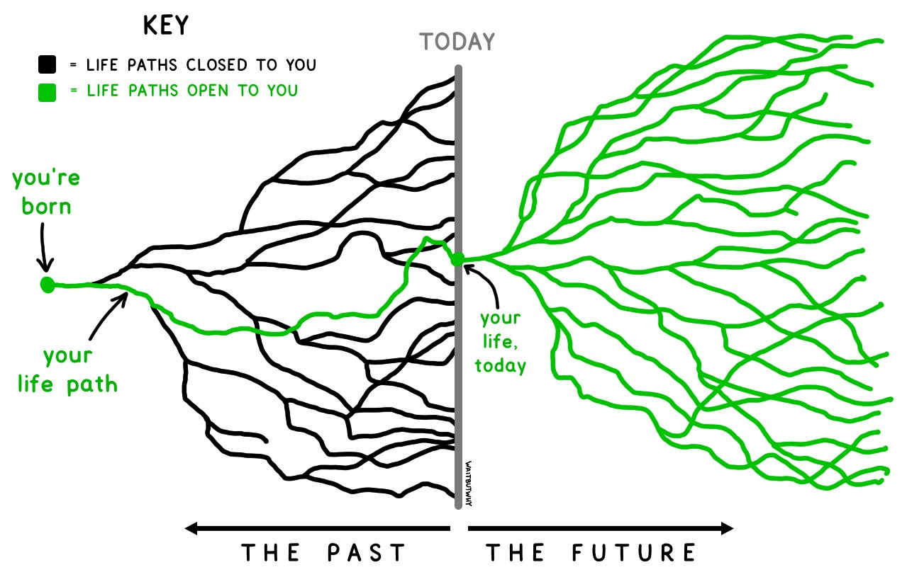

#  Measuring personal growth

3 thang đo:
1. Tỷ lệ/mức độ thay đổi
2. Thời gian giải quyết vấn đề
3. Số lựa chọn trong tương lai

Why?
"Tại sao tôi nhất thiết phải đo lường tất cả mọi thứ chứ? Cuộc sống này là để sống, không phải để đo lường."

## 1. Mức độ thay đổi
Tôi có một giả thuyết rằng cuộc sống có một nhịp sinh học. Mỗi 3-6 năm, bạn sẽ trở thành một người khác. Bạn giải quyết những vấn đề khác, phong cách sống của bạn thay đổi, và những người mà bạn đi chơi cùng cũng sẽ khác. Nếu bạn vẫn chưa liên lạc với 1 người bạn trong 5 năm, bạn dường như sẽ không có điểm chung nào với họ nữa, trừ việc 2 người quen nhau. Không phải là một sự trùng hợp khi mà các cấp học cũng được phân thành từng giai đoạn 3,4,5 năm.

Nhìn lại, tôi nhận ra bản thân tôi cứ mỗi 3-6 năm cũng sẽ thay đổi hoàn toàn cuộc sống. Từ lớp 3 tới lớp 10, thôi chỉ cắm đầu vào việc giải toán, rồi 5 năm sau đó, tôi làm việc như một tác giả viết, rồi tôi bắt đầu nghiên cứu về khoa học máy tính trong 4 năm, rồi cuối cùng tôi loay hoay nhiều nơi trong vòng 6 năm và mãi tới hiện tại, tôi mới cảm thấy mình đã định hình được cuộc sống của mình.

Tôi tự hỏi rằng tôi có thể tự xem bản thân mình như một khoản đầu tư không, và nếu được, thì nó sẽ tốn bao lâu để tôi có thể trở thành một con người mới. Trở thành một con người mới không phải lúc nào cũng tốt, và cũng không phải là mục đích của tất cả mọi người. Nhưng đối với tôi, tôi muốn bản thân có thể nhìn mọi thứ ở một góc nhìn mới, đương đầu với những thử thách mới. Tôi trân trọng tất cả những người bạn cũ (tôi vẫn còn nói chuyện với bạn thân hồi tiểu học), nhưng tôi cũng muốn học hỏi thêm nhiều thứ từ những người bạn mới.

## 2. Thời gian mà bạn giải quyết các vấn đề
Quỳnh, một người bạn cũ, hiện đang làm một nhà xuất bản ở Việt Nam, cô ấy tin rằng có một vài vấn đề lớn trong cuộc sống như sự nghiệp, gia đình và tài chính. Và nó thường mất cả chục năm để một người có thể tìm ra cách giải quyết cho môiị vấn đề.

- Trong vòng 10 năm sau khi tốt ngiệp, bạn sẽ phải tìm ra điều bạn thực sự muốn làm với cuộc sống này.
- Trong vòng 10 năm tiếp theo, bạn sẽ kết hôn, mua một căn nhà, có con
- Trong vòng 10 năm kế tiếp, bạn sẽ xây dựng những khoản tiết kiệm cho việc nghỉ hưu

Mục tiêu của Quỳnh là giải quyết những vấn đề này nhanh hết sức có thể, để sau đó tập trung vào những điều thú vị. Điều này làm cho tôi nghĩ rằng có lẽ tôi có thể do lường sự phát triển bằng cách nhìn vào những vấn đề lớn mà tôi đã giải quyết được cho tới hiện tại. Vấn đề lớn nào mà tôi đã từng lo lắng vào thời điểm 5 năm trước, nhưng mà hiện tại thì không còn lo lắng nữa? Vấn đề lớn nào mà tôi hiện tại đang lo lắng nhưng sẽ không muốn quan tâm vào 5 năm sau?

Một vấn đề lớn tùy thuộc vào từng mỗi người. Đối với tôi, đó là sự nghiệp, tài chính, quan hệ xã hội, nơi cư trú, gia đình và sức khỏe. Đây là một danh sách những vấn đề mà khiến tôi cảm thấy dường như bản thân mình đã tiến bộ hơn. 5 năm trước, tôi cục kỳ lo lắng về việc ở lại mỹ với visa của mình. Vấn đề này biến mất khi tôi đạt được thẻ xanh của mình. 5 năm trước, tôi thường liên tục cảm thấy bất an khi nghĩ mình như là người lạc loài nhất ở khu vực của mình. Hiện tại, thì tôi thấy nơi này như ở nhà.

## 3. Số lượng lựa chọn trong tương lai
Một người bạn khác mà tôi đã gặp ở trên Discord, Denys, nói với tôi rằng bạn của anh ấy có một giả thiết rằng, cứ một vài năm thì một nửa số ước mơ của bạn sẽ chết. Mọi người thường từ bỏ ước mơ của họ bởi vì họ nhận ra rằng họ không thể đạt được nó được nữa.

Tôi thì không đồng ý với ý kiến đó. Khi càng lớn thêm, tôi lại càng có thêm nhiều ước mơ, tôi hiện tại đã biết thêm rất nhiều thứ mà tôi chưa chưa từng biết trước đó, và tôi cũng có nhiều cơ sở hơn trước đó. Nó cho phép tôi làm nhiều thứ mà trước đó tôi đã nghĩ là bất khả thi.

Trong thời gian củng cố cho một khóa học ở trường đại học, tôi học được phương pháp “trao quyền đối đa”. Đó là một nguyên lý mà nó cho phép robot thực hiện hành vi một cách thông minh hơn. Trong trường hợp mà robot không chắc chắn về một hành động, “trao quyền tối đa” sẽ cho phép nó tự đưa ra quyết định dựa trên tính toán lựa chọn đem lại nhiều phương án nhất trong tương lai. Ví dụ khi robot phải lựa chọn nữa nhiều công tắc, nó sẽ lựa chọn công tắc nào mở được nhiều cửa nhất.

Tôi nhận ra mình cũng đã đang ứng dụng nguyên lý đó. Những lần không chắc chắn về 1 lựa chọn, tôi thường nghiên về phương án mà cho tôi nhiều lựa chọn hơn trong tương lai. Có lần, tôi chọn một công việc được trả ít lương hơn nhưng tôi được phép làm việc với các mã nguồn mở và được công bố các bài báo. Tôi sẽ ưu tiên những nhiệm vụ có thể dạy cho tôi nhiều thứ thay vì những nhiệm vụ giới hạn trong khả năng.

Có lẽ tôi cũng có thể đo lường sự tiến bộ của tôi bằng số lượng những lựa chọn mà tôi đã đạt được hay đánh mất. Những lựa chọn tôi hiện tại đang có mà 5 năm trước thì không? Những lựa chọn tôi đã từng có thể chọn 5 năm trước nhưng giờ thì không? Quan trọng nhất, điều gì tôi sẽ muốn ở 5 năm sau mà hiện tại tôi có thể lựa chọn ?

Sami chỉ ra cho tôi bức ảnh này và tôi bất chợt ngừng lại và suy nghĩ tại sao. Khi thời gian trôi qua, rất nhiều cánh cửa đã đóng lại với chúng ta, nhưng rất nhiều cánh cửa khác cũng đã mở ra. Trong khi bạn của Denys suy nghĩ về những đường màu đen phía trước, tôi lại tập trung vào những dòng màu xanh phía bên phải.

# Kết luận
Đây là 3 phương pháp mà tôi tuân theo để phát triển bản thân:

1. Tôi sẽ cố gắng trở thành một con người mới mỗi 3-6 năm
2. Tôi sẽ cố gắng giải quyết những vấn đề lớn nhanh nhất có thể. Tôi xem đây là một tấm lưới an toàn cho phép tôi đương đầu với những rủi ro để khám phá nhiều thứ hơn trong tương lai.
3. Tôi sẽ hành động theo phương án cho phép tôi có nhiều lựa chọn nhất trong tương lai.

3 phương pháp này đã và đang hoạt động với tôi bởi vì tôi nghĩ rất nhiều về những sự mới lạ và khám phá. Có lẽ ngày nào đó tôi sẽ mệt mỏi với việc đó và những phương pháp này sẽ thay đổi. Nhưng khi nhiều đó xảy ra có nghĩa là tôi đã trở thành con người mới, và tôi đã lớn lên.

# References
- Thanks anh Lưu, và tác giả chị Huyền