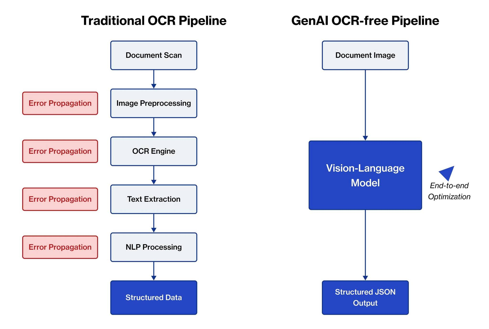

Vì sao đa số demo OCR hiện nay không thể dùng trong production?
OCR là một trong những bài toán “kinh điển” và cũng có lẽ là dạng có nhiều demo project nhất mà dân AI có thể tìm thấy trên mạng.
Tuy nhiên khi đưa demo đó vào triển khai thực tế lại có nhiều câu chuyện phải xử lý hơn là kết quả của model - chúng ta sẽ cần quan tâm nhiều hơn đến dữ liệu, pipeline xử lý, serving và vận hành hệ thống.
Vậy một hệ thống OCR production-ready thực sự trông như thế nào?
Dưới đây là cấu trúc 1 hệ thống AI Understanding Document (tiêu chuẩn Banking & Enterprise) chia thành nhiều Layer các bạn có thể tham khảo:
Processing Layer: Layout Detection, Text Detection, OCR, Key Information Extraction (KIE) hoặc reasoning bằng VLM/LLM - mỗi thành phần có thể sử dụng model và framework khác nhau tùy vào mục tiêu accuracy, latency và cost. Trong thực tế, layer này thường là một multi-model pipeline thay vì chỉ “1 model OCR duy nhất”.
Serving Layer: Inference Server (Triton Server, vLLM…), Request Scheduling, Dynamic Batching, GPU Resource Management - tối ưu cách model xử lý request thực tế để hệ thống có thể chạy nhanh, ổn định và tiết kiệm tài nguyên khi lượng document tăng lớn.
Deployment Layer: API Service (FastAPI, REST API…), Containerization (Docker), Monitoring & Logging, Autoscaling, Deployment & Versioning - giúp hệ thống AI có thể deploy, mở rộng, theo dõi và vận hành ổn định trong môi trường production thực tế.
Xu hướng multi-model pipeline — kết hợp OCR pipeline truyền thống với LLM/VLM
Ngoài phần cấu trúc, thì mình cũng muốn zoom thêm về phần process layer - phần này chắc nhiều bạn cũng quan tâm.
Bài toán OCR đang có 2 hướng phát triển chủ yếu là Traditional OCR Pipeline và Vision Language Model (VLM)
Hướng đầu tiên là Traditional OCR Pipeline với flow phổ biến gồm Layout Detection, Text Detection, OCR và KIE. Đây vẫn là kiến trúc được dùng rất nhiều trong doanh nghiệp vì chạy nhanh hơn, dễ kiểm soát và phù hợp với hệ thống xử lý số lượng lớn document mỗi ngày. Tuy nhiên, nhược điểm là pipeline khá phức tạp và càng nhiều loại chứng từ thì càng khó maintain.
Hướng thứ hai là Vision Language Model (VLM), tập trung vào OCR-free extraction, multimodal understanding và end-to-end reasoning. Một số hướng nổi bật hiện nay gồm GLM-OCR, GOT-OCR, DocOwl hay Qwen-VL. Cách tiếp cận này linh hoạt hơn và xử lý tốt hơn với các document phức tạp hoặc format không cố định. Tuy nhiên, đổi lại là chi phí vận hành cao hơn, tốc độ xử lý chậm hơn và khó tối ưu hệ thống hơn rất nhiều khi đưa vào production.
Mỗi hướng đều có đánh đổi riêng, vậy nên chọn cái nào? Cách tối ưu nhất sẽ là hybrid architecture kết hợp OCR pipeline xử lý phần chính, còn LLM/VLM xử lý các case khó hoặc cần reasoning.

