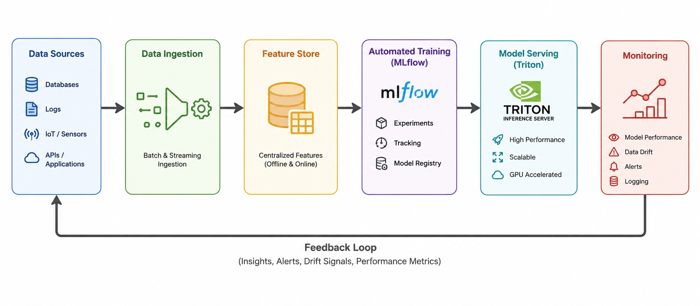
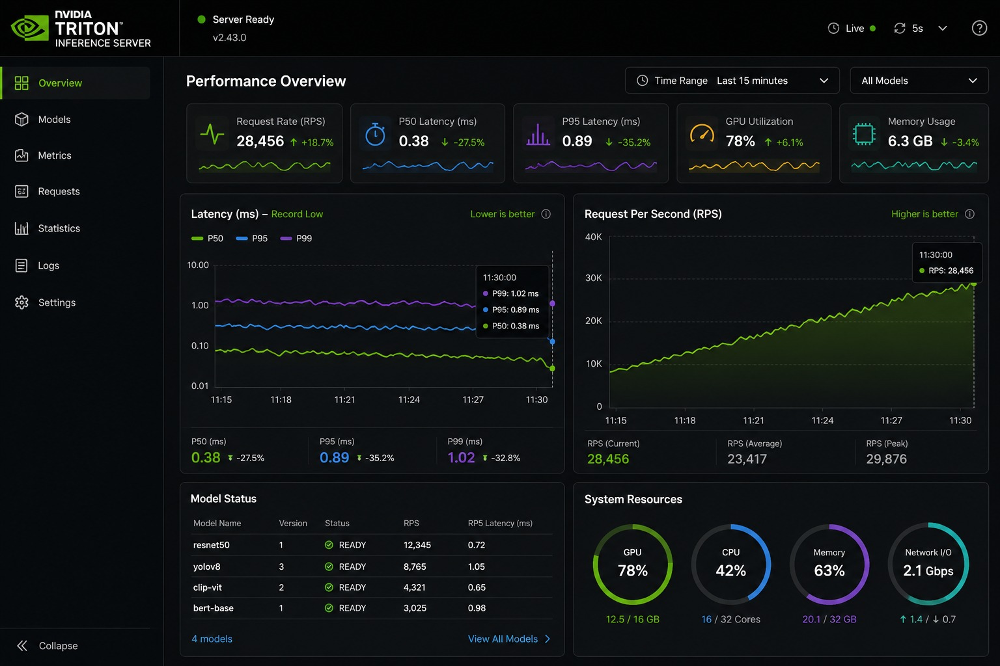

QUY TRÌNH THIẾT KẾ HỆ THỐNG AI (AI SYSTEM DESIGN) CHO NGƯỜI MỚI BẮT ĐẦU
Sự khác biệt lớn nhất giữa một Kỹ sư AI Junior và một Senior không nằm ở việc ai thuộc nhiều thuật toán hơn, mà ở việc ai có khả năng đưa mô hình đó lên Production chạy ổn định.
Nhiều bạn mới vào nghề thường sở hữu những file Jupyter Notebook chạy rất mượt trên máy cá nhân với các chỉ số Accuracy hay F1-score đẹp như mơ. Thế nhưng, khi đưa vào thực tế để phục vụ hàng triệu người dùng, hệ thống lập tức sập do quá tải, độ trễ cao hoặc mô hình bị "lỗi thời" sau vài tuần.
Để giải quyết bài toán đó, bạn cần có tư duy về AI System Design (Thiết kế hệ thống AI). Bài viết này sẽ hướng dẫn bạn quy trình 4 bước cốt lõi để kiến trúc một hệ thống AI thực chiến chuẩn doanh nghiệp.
1. Bức tranh tổng quan về AI System Design
Trong kỹ nghệ phần mềm truyền thống, bạn chỉ cần quản lý Code. Nhưng trong hệ thống AI, bạn phải quản lý "bộ ba thế lực": Code + Data (Dữ liệu) + ML Model (Mô hình).
Một kiến trúc AI System Design cơ bản sẽ bao gồm 4 trụ cột chính liên kết chặt chẽ với nhau:
[Data Ingestion] ➔ [Automated Training] ➔ [Model Serving] ➔ [Monitoring]
▲ │
└─────────────────── Feedback Loop ────────────────────────┘
2. Chi tiết 4 bước kiến trúc hệ thống AI thực chiến
Bước 1: Data Ingestion & Pipeline (Tiếp nhận & Xử lý dữ liệu)
Dữ liệu trên Production rất "hỗn loạn": chúng đến từ ứng dụng, trang web, thiết bị IoT với đủ mọi định dạng (structured và unstructured) và tốc độ khác nhau. Nhiệm vụ của bạn là phải gom chúng lại và biến thành định dạng mà Model có thể hiểu được.
Batch Processing (Xử lý theo lô): Dành cho dữ liệu không cần gấp. Bạn có thể dùng Apache Airflow hoặc Prefect để lập lịch chạy định kỳ (ví dụ: mỗi đêm gom dữ liệu hành vi người dùng ngày hôm đó để xử lý).
Stream Processing (Xử lý thời gian thực): Dành cho hệ thống cần phản hồi ngay lập tức (như phát hiện gian lận thẻ tín dụng). Bạn cần các công cụ như Apache Kafka hoặc Flink để thu thập dữ liệu theo từng mili-giây.
Tập trung vào Feature Store: Đây là một thành phần cực kỳ quan trọng trong AI System Design (ví dụ: Feast). Feature Store đóng vai trò như một kho lưu trữ tập trung các đặc trưng dữ liệu. Nó đảm bảo bộ dữ liệu bạn dùng để Train và bộ dữ liệu bạn dùng để Dự đoán (Inference) đồng nhất với nhau, tránh hiện tượng Data Leakage (rò rỉ dữ liệu).
Bước 2: Automated Training Pipeline (Tự động hóa huấn luyện)
Một sai lầm kinh điển của người mới là huấn luyện mô hình bằng tay một lần, đem deploy và... bỏ mặc nó. Thực tế, dữ liệu luôn thay đổi theo thời gian dẫn đến hiện tượng Data Drift hoặc Concept Drift (mô hình bị giảm độ chính xác). Hệ thống AI của bạn bắt buộc phải có khả năng tự động học lại.
Tự động kích hoạt (Trigger): Sử dụng Kubeflow Pipelines hoặc MLflow để cấu hình. Hệ thống sẽ tự động chạy pipeline huấn luyện lại khi: (1) Đến lịch định kỳ, (2) Có một lượng dữ liệu mới đủ lớn, hoặc (3) Hiệu năng của mô hình hiện tại trên Production bị tụt giảm dưới ngưỡng cho phép.
Model Registry (Kho quản lý mô hình): Nơi lưu trữ các phiên bản của Model ($V_1, V_2, V_3$). Tại đây, mỗi phiên bản sẽ được đính kèm metadata: Ai là người train? Độ chính xác bao nhiêu? Train trên bộ dữ liệu nào? để dễ dàng rollback (quay xe) nếu mô hình mới gặp lỗi.
Bước 3: Real-time Model Serving (Phục vụ người dùng cuối)
Làm sao để Model trả về kết quả dự đoán cho khách hàng trong vòng dưới 100ms khi có hàng ngàn người truy cập cùng lúc? Đừng nghĩ đến việc gói mô hình vào một API Flask hay FastAPI thông thường nếu bạn muốn làm việc ở quy mô lớn.
Inference Server chuyên dụng: Hãy hướng tới Triton Inference Server (NVIDIA), TorchServe, hoặc TensorFlow Serving. Các công cụ này được tối ưu hóa ở tầng phần cứng, hỗ trợ gom cụm request (Dynamic Batching) và tận dụng tối đa sức mạnh của GPU/CPU.
Chiến lược Caching với Redis: Đối với các request lặp đi lặp lại (ví dụ: gợi ý sản phẩm hot cho người dùng mới), hãy lưu kết quả vào Redis. Hệ thống sẽ lấy ngay kết quả từ RAM trả về cho user mà không cần bắt Model Server phải tính toán lại, giảm tải tối đa cho hạ tầng.
Tối ưu hóa Model (Model Quantization): Trước khi deploy, hãy dùng các kỹ thuật như giảm độ chính xác của trọng số từ FP32 xuống INT8. Mô hình sẽ nhẹ hơn gấp 4 lần và tốc độ tính toán tăng lên đáng kể mà độ chính xác gần như không đổi.
Bước 4: Monitoring & Feedback Loop (Giám sát và Vòng lặp phản hồi)
Mô hình chạy xong không có nghĩa là công việc của bạn kết thúc. Bạn cần một "hệ thống cảnh báo sớm" để biết khi nào AI đang hoạt động tệ.
Hệ thống giám sát (Monitoring) trong AI chia làm 2 tầng:
Tầng hạ tầng (System Metrics): Đo lường CPU, RAM, GPU utilization, dung lượng lưu trữ và độ trễ API. Bộ đôi Prometheus + Grafana là tiêu chuẩn vàng ở đây.
Tầng ML (ML Metrics): Giám sát sự thay đổi của phân phối dữ liệu đầu vào bằng các thư viện như Evidently AI hoặc Whylogs. Ví dụ: Nếu đột nhiên hệ thống nhận vào toàn dữ liệu có định dạng lạ, nó sẽ gửi cảnh báo về Telegram/Slack cho bạn.
Feedback Loop (Vòng lặp phản hồi): Hệ thống phải thu thập được phản hồi ngầm từ người dùng. Ví dụ, AI gợi ý một bài hát, nếu người dùng bấm "Next" ngay lập tức, đó là một tín hiệu xấu. Dữ liệu này sẽ được gắn nhãn tự động và quay trở lại Bước 1 để làm nguyên liệu cho đợt train tiếp theo.
3. Case Study: Thiết kế hệ thống gợi ý món ăn theo thời gian thực
Để dễ hình dung, chúng ta hãy áp dụng quy trình trên vào bài toán: Thiết kế hệ thống gợi ý món ăn cho một ứng dụng giao đồ ăn.
[Hành vi User trên App] ➔ [Kafka Stream] ➔ [Feature Store]
│ (Lấy Feature)
▼
[User mở App] ➔ [Triton Server] ◄────────────┘
│
▼ (Trả về kết quả trong 50ms)
[Danh sách món ăn]
Data Ingestion: Khi người dùng lướt app, các hành vi như Click vào món Bún chả, Tìm kiếm từ khóa "Healthy" sẽ được đẩy vào Kafka theo thời gian thực và cập nhật ngay vào Feature Store.
Model Serving: Ngay khi người dùng vừa mở app, một request được gửi tới Triton Inference Server. Server này lập tức gọi sang Feature Store để lấy nhanh các đặc trưng vừa cập nhật của user, đưa vào mô hình Deep Learning và trả về danh sách 10 món ăn phù hợp nhất trong vòng 50ms.
Automated Training: Cứ mỗi 2 giờ, hệ thống dựa vào số lượng món ăn người dùng thực sự đặt (Feedback) để tự động kích hoạt một pipeline MLflow train lại mô hình nhằm cập nhật khẩu vị mới nhất của khách hàng.
Lời khuyên cho người mới bắt đầu (Takeaways)
Đừng phức tạp hóa từ đầu (Don't over-engineer): Nếu hệ thống của bạn chỉ có vài trăm người dùng, một API FastAPI đơn giản kết hợp với một script chạy bằng Cron-job là đủ. Hãy chỉ nâng cấp lên Kubernetes, Kafka, Triton khi quy mô thực sự đòi hỏi.
Hệ thống ổn định > Thuật toán phức tạp: Một mô hình đơn giản (như Logistic Regression hoặc Random Forest) nằm trong một hệ thống vận hành trơn tru, không lỗi luôn mang lại giá trị kinh doanh cao hơn một mô hình Deep Learning SOTA (State-of-the-art) nhưng cứ chạy 10 phút lại crash một lần.

